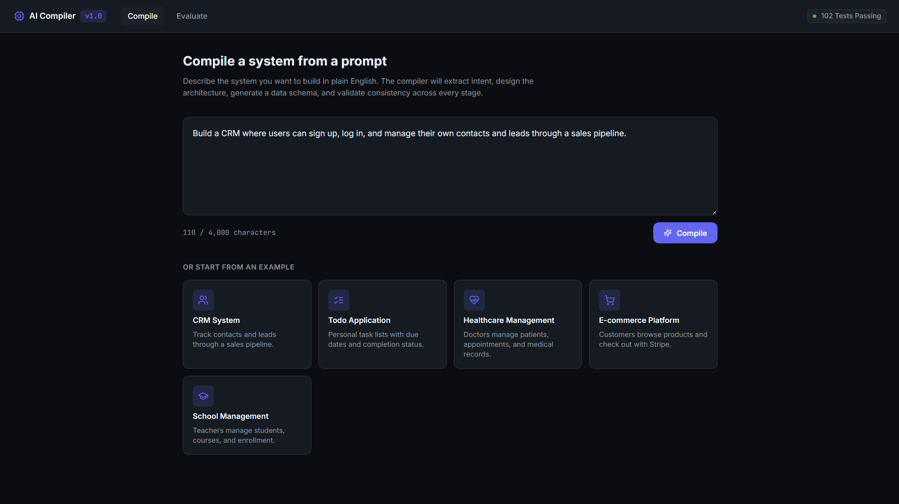
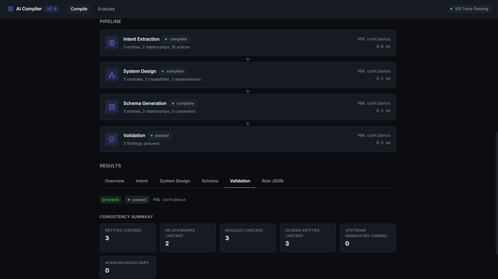
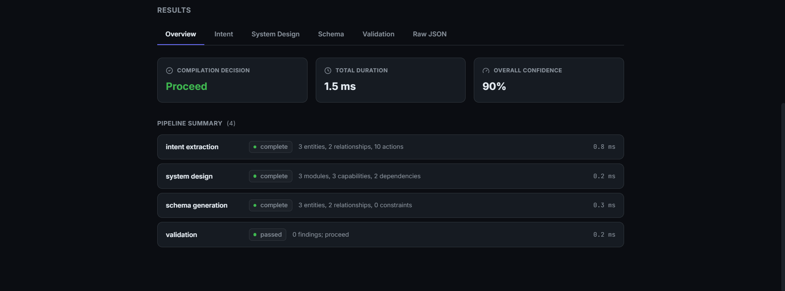
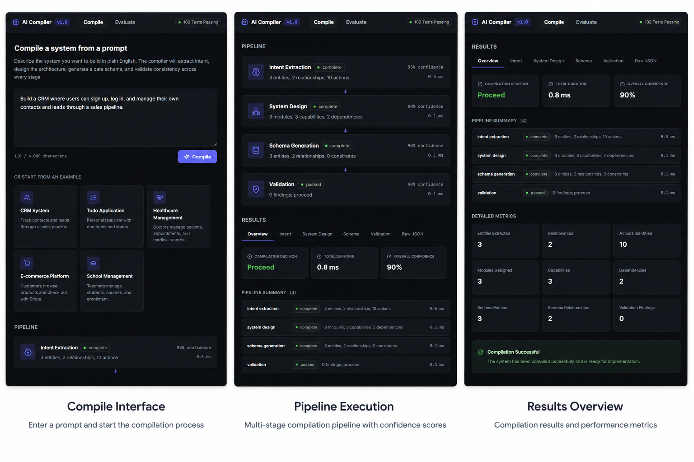

# AI Compiler

**A deterministic, multi-stage AI System Compiler that transforms natural language into validated system architecture, database schema, and implementation-ready design.**

Describe what you want to build in plain English. AI Compiler runs it through a deterministic, rule-based pipeline — no LLM calls, no non-determinism — that extracts intent, designs a modular architecture, generates a concrete data schema, and cross-validates every stage against the others before producing a single terminal compilation result.

<p>
  
  
  
  
  
  
</p>

## Table of Contents

- [Features](#features)
- [Architecture Overview](#architecture-overview)
- [Project Structure](#project-structure)
- [Screenshots](#screenshots)
- [Installation](#installation)
- [Running the Backend](#running-the-backend)
- [Running the Frontend](#running-the-frontend)
- [Running Tests](#running-tests)
- [Roadmap](#roadmap)
- [License](#license)

## Features

- **Multi-stage compilation pipeline** — a single prompt flows through four deterministic stages, each producing a validated, strongly-typed intermediate representation.
- **Intent Extraction** — parses a natural-language prompt into entities, relationships, actions, user stories, requirements, integrations, and risk flags.
- **System Design Generation** — decomposes extracted intent into modules, capabilities, workflows, actors, and module dependencies.
- **Database Schema Generation** — produces concrete entities, fields, relationships, and constraints (e.g. encryption, audit logging) from the system design.
- **Validation Engine** — cross-checks all three upstream artifacts for traceability, consistency, and risk propagation, then issues a single terminal pipeline decision.
- **Evaluation Dashboard** — runs benchmark datasets through the full pipeline and reports aggregate success/halt/error rates, per-stage confidence and duration distributions, and finding breakdowns.
- **Interactive React frontend** — a Compile workspace with live pipeline visualization and tabbed results, plus an Evaluation dashboard for running and inspecting benchmarks.
- **FastAPI backend** — a typed, fully tested REST API exposing every compiler stage independently as well as the full pipeline.
- **102 backend tests** (pytest) and **62 frontend tests** (Vitest) passing.

## Architecture Overview

AI Compiler is intentionally **deterministic and rule-based** — every stage is implemented as explicit, testable logic rather than an LLM call, so the same prompt always produces the same result.

```
Prompt
  │
  ▼
┌──────────────────────┐
│  Intent Extraction    │  →  IntentIR
└──────────┬────────────┘
           ▼
┌──────────────────────┐
│  System Design        │  →  SystemDesign
└──────────┬────────────┘
           ▼
┌──────────────────────┐
│  Schema Generation    │  →  DataSchema
└──────────┬────────────┘
           ▼
┌──────────────────────┐
│  Validation & Repair  │  →  ValidationReport
└──────────┬────────────┘
           ▼
    CompilationResult
```

A `RuntimeService` orchestrates the four stages end-to-end, timing each one and assembling their outputs into a single `CompilationResult`. An `EvaluationService` streams batches of prompts through that same runtime and folds the results into one aggregate `BenchmarkResult`, without ever holding more than O(1) memory per dataset.

| Stage | Input | Output | Responsibility |
|---|---|---|---|
| Intent Extraction | Raw prompt | `IntentIR` | Entities, relationships, actions, requirements, risks, ambiguities |
| System Design | `IntentIR` | `SystemDesign` | Modules, capabilities, workflows, actors, dependencies |
| Schema Generation | `IntentIR` + `SystemDesign` | `DataSchema` | Fields, types, relationships, constraints |
| Validation & Repair | All of the above | `ValidationReport` | Cross-stage consistency checks and the terminal pipeline decision |

### API Endpoints

| Method | Path | Description |
|---|---|---|
| `GET` | `/health` | Health check |
| `POST` | `/intent/extract` | Run Intent Extraction in isolation |
| `POST` | `/system-design` | Run System Design from an `IntentIR` |
| `POST` | `/schema-generation` | Run Schema Generation from an `IntentIR` + `SystemDesign` |
| `POST` | `/validate` | Run Validation across all three upstream artifacts |
| `POST` | `/compile` | Run the full pipeline for a prompt and return a `CompilationResult` |
| `POST` | `/evaluate` | Run a batch of dataset cases and return an aggregate `BenchmarkResult` |

## Project Structure

```
AI-Compiler/
├── backend/                 FastAPI application
│   ├── app/
│   │   ├── api/             Route handlers for each compiler stage
│   │   ├── models/          Pydantic IR models (IntentIR, SystemDesign, DataSchema, ...)
│   │   ├── schemas/         Request payload schemas
│   │   ├── services/        Deterministic compiler logic for each stage
│   │   └── main.py          Application entrypoint
│   └── scripts/             CLI demo for running the pipeline locally
├── frontend/                React + Vite + TypeScript application
│   └── src/
│       ├── api/             Typed fetch layer for the backend API
│       ├── components/      Compile, Evaluation, and shared UI components
│       ├── pages/           CompilePage, EvaluationPage
│       ├── store/           Zustand state stores
│       └── types/           TypeScript mirrors of the backend models
├── tests/
│   ├── backend/             pytest suite (102 tests)
│   └── frontend/            Vitest + Testing Library suite (62 tests)
├── docs/                    Architecture and setup documentation
└── evaluation/              Evaluation framework notes
```

## Screenshots

| Compile Interface | Pipeline Execution |
|---|---|
|  |  |

| Results Overview | Full Demo |
|---|---|
|  |  |

## Installation

**Prerequisites:**

- Python 3.11+
- Node.js 18+ and npm

```bash
git clone https://github.com/<your-org>/AI-Compiler.git
cd AI-Compiler
```

## Running the Backend

```bash
python -m venv .venv
source .venv/bin/activate      # .venv\Scripts\activate on Windows

pip install -r requirements.txt
uvicorn app.main:app --reload --app-dir backend
```

The API will be available at `http://127.0.0.1:8000`, with interactive docs at `http://127.0.0.1:8000/docs`.

## Running the Frontend

```bash
cd frontend
npm install
npm run dev
```

The app will be available at `http://localhost:5173` and is preconfigured (via CORS) to talk to the backend at `http://127.0.0.1:8000`.

## Running Tests

```bash
# Backend (pytest)
pytest

# Frontend (Vitest)
cd frontend
npm run test
```

| Suite | Framework | Tests |
|---|---|---|
| Backend | pytest | 102 passing |
| Frontend | Vitest + Testing Library | 62 passing |

## Roadmap

- [ ] Persistent compilation and evaluation history
- [ ] Custom dataset import from JSONL files in the Evaluation dashboard
- [ ] Pluggable extraction backend (swap the deterministic rule engine for an LLM-backed implementation behind the same service interface)
- [ ] CI pipeline for automated test and build verification
- [ ] Deployment guide for the backend and frontend

## License

Distributed under the MIT License. See [LICENSE](LICENSE) for details.
